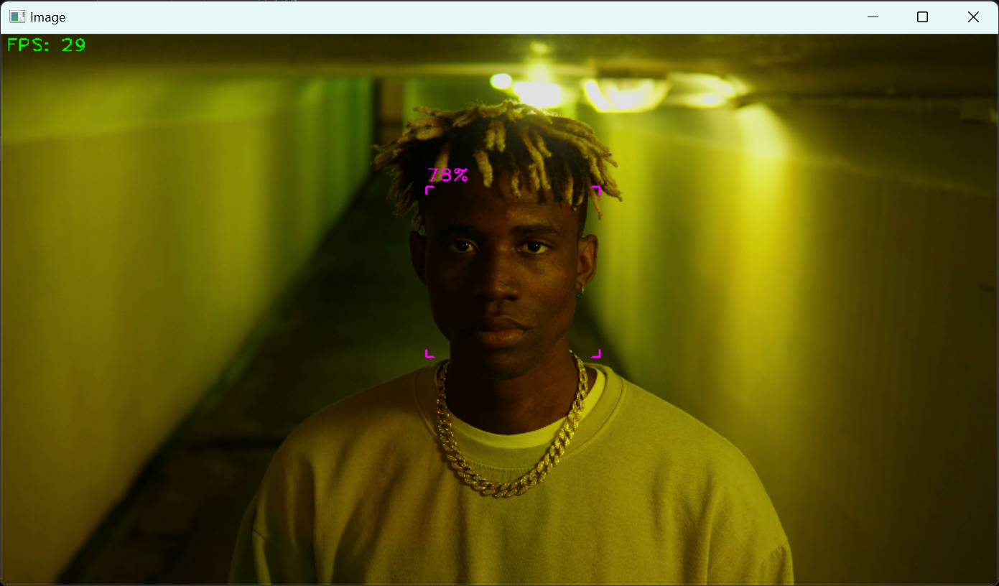
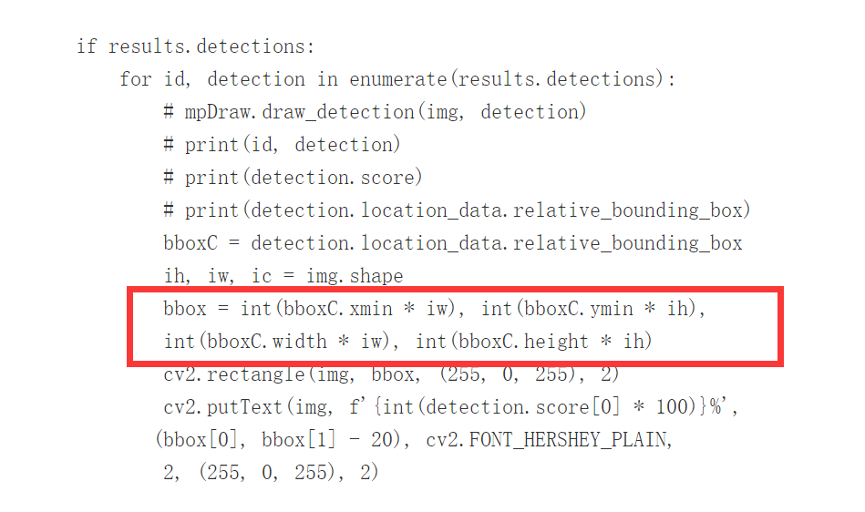
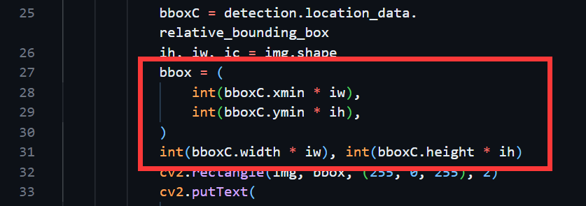
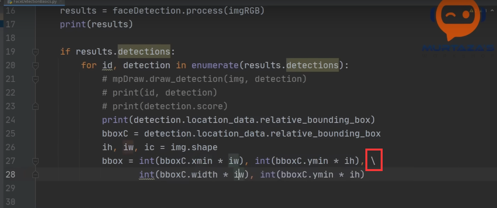

# mp.solutions.face_detection

`mpFaceDetection = mp.solutions.face_detection` 初始化MediaPipe的人脸检测模块

`faceDetection = mpFaceDetection.FaceDetection(0.75)` 创建一个 MediaPipe 的人脸检测器对象，并设置检测置信度阈值为0.75

`results = faceDetection.process(imgRGB)`  处理图像，进行人脸检测

`mpFaceDetection.FaceDetection()` 的参数主要有：

`min_detection_confidence` 用于设置检测置信度阈值，默认值通常是 0.5

# 边框信息

获取人脸检测的边界框信息:

```python
bboxC = detection.location_data.relative_bounding_box
ih, iw, ic = img.shape
bbox = (
    int(bboxC.xmin * iw),
    int(bboxC.ymin * ih),
    int(bboxC.width * iw),
    int(bboxC.height * ih),
)
```

原版：


自定义：



矩形框看起来不完整且不断变化，可能是因为：

- 视频帧更新：每帧都会重新绘制，可能导致视觉上有闪烁或变化

- 检测结果不稳定：人脸检测结果在不同帧之间不稳定，边框可能会跳动

# 源代码的一个小问题

如果你去网站上看代码，会发现一个错误：



你直接复制代码到vscode里面会出错：



翻了一下视频，才发现：



有个换行的反斜杠，在网站上没显示出来，原本这里应该是逗号连接的元组，结果现在好了，如果直接复制进vscode，它自动识别，帮你把前两个装在一起了，后两个落下了，好在也不难发现

# 注意事项

如果出现如下报错：

> cv2.error: OpenCV(4.10.0) D:\a\opencv-python\opencv-python\opencv\modules\highgui\src\window.cpp:1301: error: (-2:Unspecified error) The function is not implemented. Rebuild the library with Windows, GTK+ 2.x or Cocoa support. If you are on Ubuntu or Debian, install libgtk2.0-dev and pkg-config, then re-run cmake or configure script in function 'cvShowImage'

请把终端移动到最外层文件夹运行（对于vscode就是打开最外层文件夹），我也不是很清楚为什么会出现这种bug

以及视频文件的路径请使用**绝对路径**