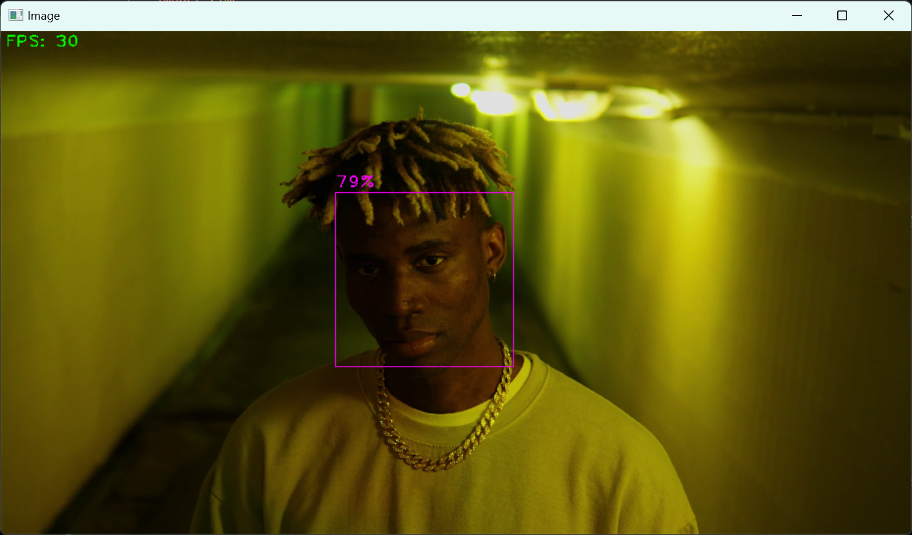

# mp.solutions.face_detection

`mpFaceDetection = mp.solutions.face_detection` initializes the MediaPipe face detection module.

`faceDetection = mpFaceDetection.FaceDetection(0.75)` creates a MediaPipe face detector object with a detection confidence threshold of 0.75.

`results = faceDetection.process(imgRGB)` processes the image for face detection.

The parameters of `mpFaceDetection.FaceDetection()` mainly include:

`min_detection_confidence` sets the detection confidence threshold, usually with a default value of 0.5.

# Bounding Box Information

To get the bounding box information for face detection:

```python
bboxC = detection.location_data.relative_bounding_box
ih, iw, ic = img.shape
bbox = (
    int(bboxC.xmin * iw),
    int(bboxC.ymin * ih),
    int(bboxC.width * iw),
    int(bboxC.height * ih),
)
```

Original:



Custom:


The rectangle may appear incomplete and change constantly because:

- Video Frame Update: Each frame is redrawn, which may cause visual flicker or changes.
- Unstable Detection: Face detection results may be unstable between frames, causing the bounding box to jump.

# A Small Issue with the Source Code

If you check the code on the website, you'll find an error:


Copying the code directly into VSCode will cause an error:


After checking the video, I found:


There was a line continuation backslash missing on the website. Originally, it should have been a tuple connected by a comma. If you copy it directly into VSCode, it automatically recognizes and groups the first two elements together, leaving the last two out. Fortunately, it's not hard to spot.

# Notes

If you encounter the following error:

> cv2.error: OpenCV(4.10.0) D:\a\opencv-python\opencv-python\opencv\modules\highgui\src\window.cpp:1301: error: (-2:Unspecified error) The function is not implemented. Rebuild the library with Windows, GTK+ 2.x or Cocoa support. If you are on Ubuntu or Debian, install libgtk2.0-dev and pkg-config, then re-run cmake or configure script in function 'cvShowImage'

Please run the terminal from the outermost folder (for VSCode, open the outermost folder). I'm not entirely sure why this bug occurs.

Also, please use **absolute paths** for the video file.