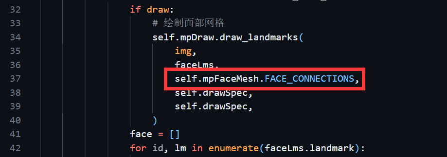
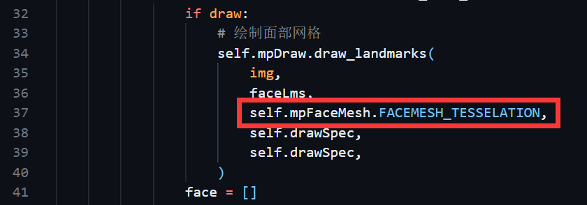
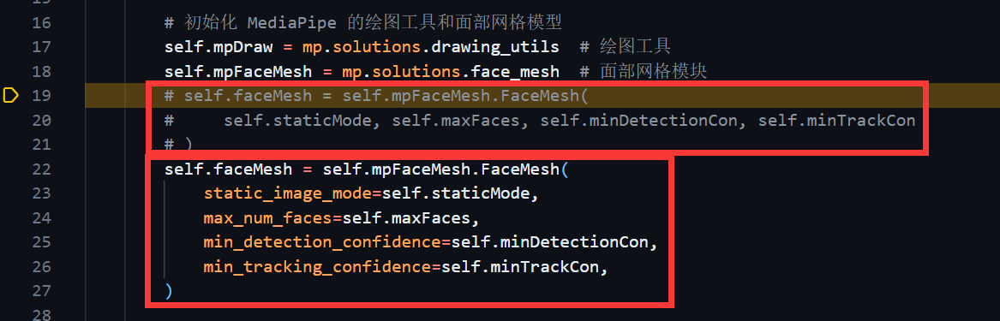

# mp.solutions.face_mesh

`mpFaceMesh = mp.solutions.face_mesh` 导入 MediaPipe 的面部网格模块，用于检测和处理面部特征点

`faceMesh = mpFaceMesh.FaceMesh(max_num_faces=2)` 初始化面部网格模型，设置最多检测两张人脸

`results = faceMesh.process(imgRGB)` 处理图像以检测面部网格

`mpFaceMesh.FaceMesh()` 类的参数有：self.staticMode, self.maxFaces, self.minDetectionCon, self.minTrackCon

> staticMode:是否将每帧图像作为静态图像处理。如果为 True，每帧都会进行人脸检测；如果为 False，在检测到人脸后进行跟踪，速度更快
> maxFaces:要检测的最大人脸数量
> minDetectionCon:检测的最小置信度阈值。低于此值的人脸将被忽略
> minTrackCon:跟踪的最小置信度阈值。低于此值的跟踪将被忽略

# mp.solutions.drawing_utils

`mpDraw = mp.solutions.drawing_utils` 导入 MediaPipe 的绘图工具模块

`drawSpec = mpDraw.DrawingSpec(thickness=1, circle_radius=2)` 创建一个绘图规格对象，用于定义标志点和连接线的绘制样式，thickness 指定线的厚度，circle_radius 指定标志点的半径

`mpDraw.draw_landmarks(img, faceLms, mpFaceMesh.FACEMESH_TESSELATION, drawSpec, drawSpec)` mpDraw.draw_landmarks 调用 MediaPipe 的绘图函数，用于在图像上绘制标志点和连接

> img: 要在其上绘制标志点的图像
> faceLms: 检测到的人脸标志点集合
> mpFaceMesh.FACEMESH_TESSELATION: 指定要绘制的连接类型，这里是面部网格的细分连接
> drawSpec: 定义标志点和连接线的绘制样式（如厚度和圆圈半径）
> 后面两个drawSpec，第一个用于定义标志点（关键点）的绘制样式，比如圆圈的半径和颜色，第二个用于定义连接线的绘制样式，比如线的厚度和颜色

# 源代码的小问题

这些bug直接运行是不会报错的，只有调试的时候才会报错

## 1、有个参数在新版本换名字了

原来：

现在：

## 2、有个位置传参需要修改成关键字传参

