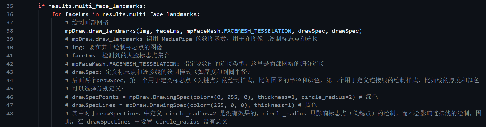

中文版本 | [English version](https://github.com/Diraw/Advance-Computer-Vision-with-Python/tree/main_en)

# Advance Computer Vision with Python

本仓库可用于计算机视觉入门，代码基于 [Advance Computer Vision with Python](https://www.computervision.zone/courses/advance-computer-vision-with-python/) 进行修改，更加适合中国宝宝体质

本仓库计划用于2024成都理工大学人工智能协会技术培训使用

<table width="100%">
  <tr>
    <td width="60%"></td>
    <td width="40%"></td>
  </tr>
  <tr>
    <td colspan="2"></td>
  </tr>
  <tr>
    <td colspan="2"></td>
  </tr>
</table>

## 本仓库的优势

1. 在源代码的基础上加入了非常多的注释，对于初学者会遇到的各种问题都做了解释。例如：




2. 在源代码的基础上加入了更多人性化的设计，例如使窗口大小可手动调整，设置退出键等操作

3. 所有代码均可成功运行。在遇到新旧代码变动的情况，会在相应文件夹的 `README.md` 文件中指出，例如：


4. 每个章节均有 `README.md` 文件，对重要的知识点进行汇总，方便复习

## 项目依赖

- Python: `3.8`
- OpenCV: `4.10.0`
- MediaPipe: `0.10.10`
- Pycaw: `20240210`
- autopy: `4.0.0`

## Conda创建环境流程

```bash
conda create -n visionpy python=3.8
conda activate visionpy
pip config set global.index-url https://pypi.tuna.tsinghua.edu.cn/simple
pip install opencv-python==4.10.0
pip install mediapipe==0.10.10
pip install pycaw==20240210
pip install autopy==4.0.0
```
